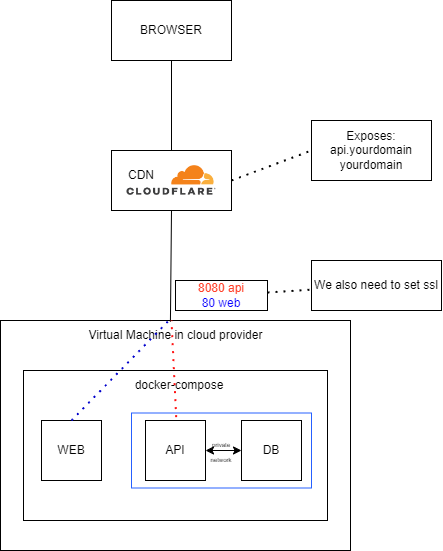

# Docker Related Wiki

## Architecture Overview


## Api docker image
This app contains a really simply dockerfile, it does not follows the best practices for a production environment, but it is enough for our use case

In order to build the image, you need to compile the maven project from the /api directory, so we will get the java fat jar:
```
mvn clean package
```

After that execute the following:
```
docker build -t yourdockeruser/api:x.y.z
```
Now, you have the docker image, so let's push it to dockerhub
```
docker push yourdockeruser/api:x.y.z
```
If you want to check that the image is working fine, you can run it using the following command, but please, be aware that you need a database and the following env variables set:
```
set db_url=
set db_name=
set db_user=
set db_password=
```
```
docker run --network="host" -p 8080:8080 -e db_name=name -e db_user=user -e db_password=pass -e db_url yourdockeruser/api:x.y.z
```

## Frontend docker  image
Here, you only need to move to /web and execute the following
```
docker build -t yourdockeruser/web:x.y.z
```
Now, you have the docker image, so let's push it to dockerhub
```
docker push yourdockeruser/web:x.y.z
```

## Docker compose 

And here... Is were the magic happens, please, be aware that you need to modify the web project in order to get the api url from and environment variable.

You just need to move to the root project directory and execute the following:
```
docker-compose up
```